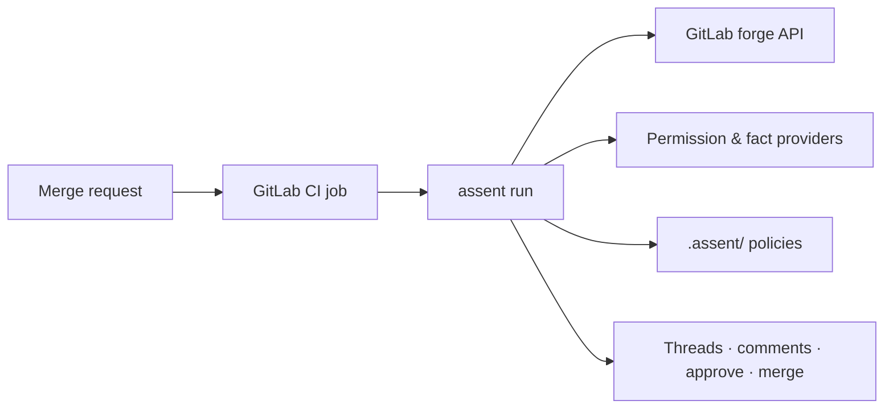

<p align="center">
  <a href="https://platformrelay.github.io/Assent/">
    <picture>
      <source media="(prefers-color-scheme: dark)" srcset="docs/assets/brand/assent-logo-light.svg">
      
    </picture>
  </a>
</p>

<p align="center">
  <a href="https://github.com/PlatformRelay/assent/actions/workflows/verify.yaml"></a>
  <a href="https://github.com/PlatformRelay/assent/actions/workflows/schemas.yml"></a>
  <a href="https://github.com/PlatformRelay/assent/actions/workflows/docs.yaml"></a>
  <a href="https://securityscorecards.dev/viewer/?uri=github.com/PlatformRelay/assent"></a>
  <a href="https://platformrelay.github.io/Assent/"></a>
  <a href="https://github.com/PlatformRelay/assent/blob/main/LICENSE"></a>
</p>

<p align="center"><em>Deterministic, policy-driven auto-merge for self-service repos</em></p>

> **Canonical repo:** GitHub ([PlatformRelay/assent](https://github.com/PlatformRelay/assent)).
> **Status: alpha** — the GitLab CI path is **Core** (E2–E8 engine, forge, provider, renderer).
> Pre-1.0: policy schema and CLI flags may change between releases; see
> [API stability](API_STABILITY.md).

**assent** is a deterministic, policy-driven **auto-merge gate** for self-service
configuration repositories. Drop it into a repo's CI pipeline and it turns merge requests
into decisions: **approve, comment, request changes, or block** — based on rules *you*
write in **Kyverno-style declarative YAML** with CEL predicates.

**Read the docs:** **[platformrelay.github.io/Assent](https://platformrelay.github.io/Assent/)**
— vision, architecture, ADRs, install guide, and usage walkthrough. This README is the
front door; the site is the map.

## Why

Most changes to config repos (topic definitions, service catalogs, tfvars, tenant onboarding
files) are routine: a team edits *their own* entries within safe bounds. Yet a human still has
to review every MR, reconstructing the same context each time — what changed, who owns it, is
it destructive, which policy applies. assent encodes that reasoning as policy so the routine
90% merges itself and reviewers spend their attention on the risky 10%.

- **Fail-safe decisions** — every run emits an auditable `DecisionRecord`; ambiguous policy
  fails closed ([ADR-0015](docs/adr/0015-trust-boundaries-merge-integrity.md)).
- **Semantic diffs** — JSON, YAML, and HCL/tfvars parse into field-level adds/modifies/deletes,
  not line noise ([ADR-0003](docs/adr/0003-canonical-change-model.md)).
- **Testable policies** — fixture changes in, expected decision out; policies without tests
  are a lint error ([ADR-0014](docs/adr/0014-adopter-test-format.md)).

## How it works



Key property: assent is **stateless per invocation** — every run recomputes the decision
from (diff, repo snapshot, facts, policy version). No database, no long-lived service in v1.
See [system context](docs/architecture/c4-context.md) for the full C4 diagram.

## Quick start

Install from source ([install guide](docs/usage/install.md)):

```bash
go install github.com/PlatformRelay/assent/cmd/assent@latest
assent version
```

`go install` compiles without link-time stamping, so the binary it produces reports
`assent 0.0.0-dev` — even when you pin a tag (`@v0.1.0`). For a **version-stamped**
binary take the Homebrew tap or a release archive: goreleaser injects the version
(`-X main.version`) and the archives are checksum- and signature-verifiable. Both
routes are in [docs/usage/install.md](https://platformrelay.github.io/Assent/usage/install/).

Lint and test policies locally. Both commands take the **repository root** — `assent`
appends `.assent` itself, so passing `.assent/` makes it look for `.assent/.assent`:

```bash
assent lint .
assent test .
```

No repo of your own yet? A clone of this one ships runnable sample policy trees; run the
two commands above from `examples/packs/service-catalog` (that is the fixture
`hack/docs/readme_smoke_test.sh` executes this block against).

Developers: gates live in the [`Taskfile`](Taskfile.yml):

```bash
task check   # fmt + vet + lint + test
```

## Feature maturity

Honest tiers post-E8 (D-104). **Core** = shipped and covered by conformance tests; **Planned**
= designed seam, not yet implemented; **Locked** = deferred epic; **Designed** = ADR/spec only.

| Area | Status | Notes |
| --- | --- | --- |
| Policy lint / test | **Core** | `assent lint`, `assent test`, schema drift gates |
| GitLab forge | **Core** | Snapshot, resolve, reconcile, merge CAS |
| Provider builtins | **Core** | GitLab groups, ownership file, static facts |
| Renderer | **Core** | Finding threads, summaries, presentation lint |
| GitHub adapter | **Planned** | E10 — designed seam ([D-012](docs/decisions/decisions.md)) |
| Rego backend | **Locked** | E11 — CEL/assert path is Core today |
| `serve` (HTTP API) | **Designed** | E12 — CLI-only in v1 |
| Remote packs | **Locked** | E13 — local `.assent/` only |

## Learn more

| Topic | Link |
| --- | --- |
| Documentation site | [platformrelay.github.io/Assent](https://platformrelay.github.io/Assent/) |
| Install (go, curl, Homebrew) | [usage/install.md](docs/usage/install.md) |
| API & schema stability | [API_STABILITY.md](API_STABILITY.md) |
| Security policy & CI gates | [SECURITY.md](SECURITY.md) |
| Vision & personas | [docs/vision.md](docs/vision.md) |
| Architecture (C4) | [docs/architecture/](docs/architecture/) |
| Decision log | [docs/decisions/decisions.md](docs/decisions/decisions.md) |

## Repository layout

| Path | Purpose |
| --- | --- |
| `docs/` | Product docs (published via MkDocs) |
| `docs/planning/` | Contributor planning notes (not in published nav) |
| `openspec/` | Spec-driven development specs and change proposals |
| `cmd/assent/` | CLI entry point |
| `internal/` | Go packages (hexagonal: core + ports + adapters) |
| `examples/` | Sample policies and self-service repo layouts |
| `test/e2e/` | End-to-end strategy: kind-hosted GitLab / testcontainers |
| `hack/release/` | Snapshot builds, install script, release verify harness |

## License

[Apache-2.0](LICENSE) — © 2026 Konrad Heimel. Same license family as Kubernetes and Argo CD:
permissive, with an explicit patent grant.
