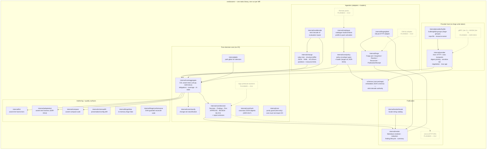

# C4 — Level 2: Containers / components

Hexagonal: a pure decision core, ports for everything with a side effect.

!!! info "How to read this page"
    Every **solid** node below names a package that exists today — verify with
    `go list ./internal/... ./cmd/...`. Every **dashed** node is a *planned* seam that
    has **no code**: it is designed, not shipped, and unlocks only when a named consumer
    commits ([D-012](../decisions/decisions.md)). Arrows follow the decision path, and
    every solid pair drawn is backed by a real import between those two packages. This is
    not the complete edge set: `cmd/assent` is the composition root and imports every
    ingestion, core, provider, render and forge package directly — those edges are
    omitted for legibility.


```mermaid
flowchart LR
    classDef planned fill:none,stroke:#8a8a8a,stroke-width:1px,stroke-dasharray:5 5,color:#8a8a8a;

    subgraph cli["cmd/assent — one static binary, one run per MR"]
        direction TB

        subgraph inbound["Ingestion (adapters + loaders)"]
            forgeGitlab["internal/forge/gitlab<br/>GitLab HTTP adapter"]
            forgePort["internal/forge<br/>Forge port: Snapshot / Resolve /<br/>Reconcile / PublicationReceipt"]
            forgeGithub["GitHub adapter<br/>PLANNED — E10"]
            change["internal/change<br/>value tree · structural differ<br/>JSON · YAML · HCL/tfvars<br/>positions + resource limits"]
            evaldecode["internal/evaldecode<br/>strict decode of<br/>evaluation inputs"]
            policy["internal/core/policy<br/>policy envelope types<br/>+ loader (target ref, ADR-0015)"]
            catalogue["internal/catalogue<br/>catalogue load/combine<br/>profile to pack activation"]
            remotepacks["Remote packs<br/>PLANNED — E13"]
        end

        subgraph core["Pure decision core (no I/O)"]
            aggregate["internal/core/aggregate<br/>CEL assert trees (cel-go, ADR-0013)<br/>obligations · coverage · tri-state"]
            classifyPkg["internal/core/classify<br/>change-set classification"]
            decision["internal/core/decision<br/>Decision · Findings · Pins<br/>APPROVE · REVIEW · BLOCK<br/>+ report emission"]
            hash["internal/core/hash<br/>canonical JSON digests<br/>(ADR-0017)"]
            glob["internal/glob<br/>path globs for selectors"]
            purity["internal/core<br/>purity guard (test-only):<br/>core must not import I/O"]
            rego["rego predicate backend<br/>PLANNED — E11"]
        end

        subgraph providers["Provider host (no forge write token)"]
            provider["internal/provider<br/>host: HTTP + exec transports<br/>digest pinning · sensitive tier<br/>negotiation · max-age"]
            builtin["internal/provider/builtin<br/>builtin/gitlab-groups (forge-groups)<br/>repo-file · resource-owner"]
            grpcw["gRPC (tier 3) + WASM (tier 4)<br/>PLANNED — ADR-0004"]
        end

        subgraph outbound["Publication"]
            render["internal/render<br/>Markdown renderer · redaction<br/>finding lifecycle · summary"]
            locale["internal/render/locale<br/>locale string catalog"]
            serve["serve (HTTP API)<br/>PLANNED — E12"]
        end

        subgraph quality["Authoring + quality surfaces"]
            lint["internal/lint<br/>assent lint hard errors"]
            adoptertest["internal/adoptertest<br/>assent test harness (ADR-0014)"]
            compare["internal/compare<br/>assent compare suite"]
            schemadrift["internal/schemadrift<br/>presentation/config drift"]
            forgeFake["internal/forge/fake<br/>in-memory forge fake"]
            forgeConf["internal/forge/conformance<br/>SHA-guarded reconcile suite"]
        end

        schemas["schemas (root package)<br/>embedded JSON schemas —<br/>strict-decode authority"]
    end

    forgeGitlab --> forgePort
    change --> aggregate
    evaldecode --> change
    evaldecode --> aggregate
    catalogue --> policy
    policy --> schemas
    policy --> aggregate
    glob --> aggregate
    aggregate --> classifyPkg
    aggregate --> decision
    builtin --> provider
    provider --> aggregate
    provider --> schemas
    decision --> render
    locale --> render
    forgePort --> render
    render --> forgeGitlab
    aggregate --> lint
    aggregate --> adoptertest
    aggregate --> compare

    forgeGithub -.-> forgePort
    remotepacks -.-> catalogue
    rego -.-> decision
    grpcw -.-> provider
    decision -.-> serve

    class forgeGithub,remotepacks,rego,grpcw,serve planned;
```

## Legend

| Style | Meaning |
| --- | --- |
| Solid border | **Shipped** — the label names a real Go package or the real binary; present in `go list ./internal/... ./cmd/...` |
| Dashed border, `PLANNED — E<n>` / `PLANNED — ADR-0004` | **Planned** — a designed seam with **no implementation**. Deferred under [D-012](../decisions/decisions.md); unlocks only when a named consumer commits. See the feature-maturity table in the repository README |
| Solid arrow | Decision-path flow; the pair is backed by a real import between those two packages |
| Dashed arrow | The port a planned seam *would* plug into — no code today |

Planned elements shown: **GitHub adapter** (E10), **Rego backend** (E11), **`serve` HTTP API**
(E12), **remote packs** (E13), **gRPC / WASM provider tiers** ([ADR-0004](../adr/0004-plugin-architecture.md)
tiers 3–4). Nothing else on this page is aspirational.

## Packages with no production importer

These packages exist and are exercised, but no production code imports them — which is why
they carry no solid arrow above. This section dates faster than the diagram; re-derive with
`go list -f '{{.ImportPath}} {{.Imports}} {{.TestImports}}' ./...`.

| Package | Reality |
| --- | --- |
| `internal/core` | Test-only guard package (`purity_test.go`); asserts the core does not import I/O |
| `internal/core/hash` | Canonical JSON digests (ADR-0017). **At this commit** imported only by `internal/change` tests — not yet on the decision path; AUD-S16 wires `internal/compare` to it |
| `internal/schemadrift` | Drift gate; imported only by the tests of `cmd/assent`, `internal/render` and `internal/forge/conformance` |
| `internal/forge/fake` | In-memory forge fake; test support only |
| `internal/forge/conformance` | Port conformance suite; runs as tests, imported by none |

## CLI surface

`cmd/assent` is the only binary. Its dispatch table today is `run`, `doctor`, `lint`, `test`,
`compare`, `catalogue`, `render`, `eval-input`, `version`, `help`. The authoritative listing
lives in the [CLI reference](../usage/cli.md), which embeds the verbatim `assent help` output
and is drift-tested against the dispatch table (`cmd/assent/main_clidoc_test.go`).

## Contracts (public, versioned)

| Contract | Consumers |
| --- | --- |
| **PolicyInput / evaluation-input** schema (incl. predicate scope) | policy authors, `assent test` harness |
| **Decision / Findings / Pins** schema | forge adapters, audit tooling, `assent compare`, test harness |
| **Provider** request/response (content-keyed FactQuery) | plugin authors — HTTP and exec today; gRPC/WASM are planned tiers (ADR-0004) |
| **Forge port** semantics (SHA-guarded writes, thread lifecycle) | adapter implementers; defined by `internal/forge/conformance` |
| **Test fixture format** ([ADR-0014](../adr/0014-adopter-test-format.md)) | adopters |

The JSON-schema families behind these contracts are embedded in the root `schemas` package and
are the strict-decode authority for the loaders above.

## Package map

The 22 packages under `internal/` plus `cmd/assent`, exactly as the diagram names them.
Regenerate with `go list ./internal/... ./cmd/...`; per-package roles are tabulated in
[`internal/README.md`](https://github.com/PlatformRelay/assent/blob/main/internal/README.md).

```text
cmd/assent                      CLI dispatch: run · doctor · lint · test · compare ·
                                catalogue · render · eval-input · version · help
internal/change                 value tree, structural differ (JSON/YAML/HCL), ChangeSet
internal/glob                   path glob matching for policy selectors
internal/core                   purity guard (test-only package — no production code)
internal/core/aggregate         CEL assert trees, obligations, coverage, tri-state
internal/core/classify          change-set classification helpers
internal/core/decision          decision/findings/pins model + report emission
internal/core/hash              canonical JSON hashing (ADR-0017 digest vectors)
internal/core/policy            policy envelope types (profiles, bindings, prove blocks)
internal/catalogue              catalogue load/combine, profile to pack activation
internal/compare                comparison-suite loader, classifiers, gates, records
internal/evaldecode             strict decode of evaluation inputs from JSON/YAML
internal/lint                   policy and presentation lint (hard-error fixtures)
internal/schemadrift            presentation/config drift detection
internal/render                 Markdown renderer, redaction, summary, finding lifecycle
internal/render/locale          locale string catalog
internal/forge                  Forge port (Snapshot/Resolve/Reconcile) + shared helpers
internal/forge/gitlab           GitLab HTTP adapter
internal/forge/fake             in-memory forge fake for tests
internal/forge/conformance      SHA-guarded reconciliation conformance suite
internal/provider               provider host (HTTP/exec transport, sensitive handling)
internal/provider/builtin       gitlab-groups (forge-groups), repo-file, resource-owner
internal/adoptertest            adopter-facing policy test helpers (ADR-0014 fixtures)
```

There is no `internal/format`, `internal/policy`, or `internal/harness` package: format
adapters live in `internal/change`, the policy envelope in `internal/core/policy` +
`internal/catalogue`, and the adopter harness in `internal/adoptertest`.
