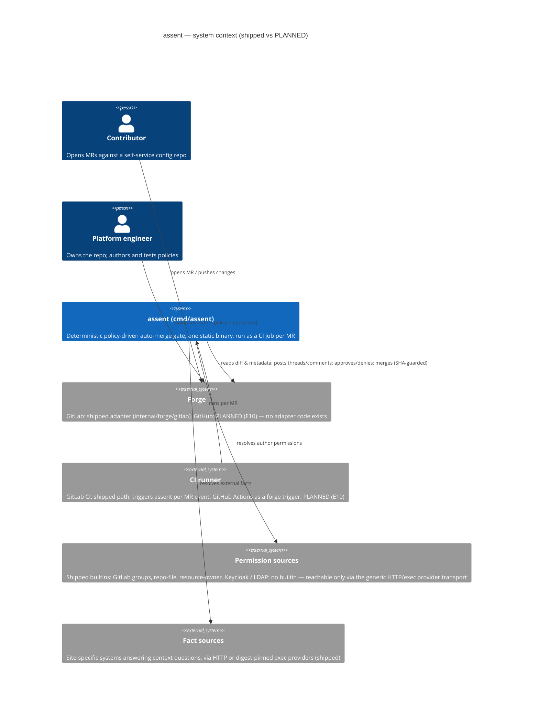

# C4 — Level 1: System context

Labels carry their own truth marker: **shipped** = implemented and covered by tests today;
**PLANNED** = a designed seam with no implementation, deferred under
[D-012](../decisions/decisions.md). The legend below repeats the distinction in prose,
because `C4Context` diagrams cannot style nodes.

```mermaid
C4Context
    title assent — system context (shipped vs PLANNED)

    Person(contributor, "Contributor", "Opens MRs against a self-service config repo")
    Person(platform, "Platform engineer", "Owns the repo; authors and tests policies")

    System(assent, "assent (cmd/assent)", "Deterministic policy-driven auto-merge gate; one static binary, run as a CI job per MR")

    System_Ext(forge, "Forge", "GitLab: shipped adapter (internal/forge/gitlab). GitHub: PLANNED (E10) — no adapter code exists")
    System_Ext(ci, "CI runner", "GitLab CI: shipped path, triggers assent per MR event. GitHub Actions as a forge trigger: PLANNED (E10)")
    System_Ext(idp, "Permission sources", "Shipped builtins: GitLab groups, repo-file, resource-owner. Keycloak / LDAP: no builtin — reachable only via the generic HTTP/exec provider transport")
    System_Ext(facts, "Fact sources", "Site-specific systems answering context questions, via HTTP or digest-pinned exec providers (shipped)")

    Rel(contributor, forge, "opens MR / pushes changes")
    Rel(platform, forge, "maintains repo + policy dir (.assent/)")
    Rel(ci, assent, "runs per MR")
    Rel(assent, forge, "reads diff & metadata; posts threads/comments; approves/denies; merges (SHA-guarded)")
    Rel(assent, idp, "resolves author permissions")
    Rel(assent, facts, "resolves external facts")
```

## Legend

| Marker | Meaning |
| --- | --- |
| no marker | **Shipped** — implemented today; the parenthetical names the real package or binary |
| `PLANNED (E<n>)` | **Planned** — designed seam, **no code**. Deferred under [D-012](../decisions/decisions.md); unlocks when a named consumer commits. `E<n>` is the deferred epic in the meta-plan |

Planned elements on this page: the **GitHub forge adapter** and the **GitHub Actions forge
trigger** (both E10). Everything else named above exists — see the
[container diagram](c4-container.md) for the package-level breakdown.

!!! note "GitHub Actions appears twice, with different meanings"
    assent's *own* repository is built and released on GitHub Actions. That is project
    infrastructure, not a supported forge path: assent cannot evaluate a GitHub PR, because
    the GitHub forge adapter (E10) does not exist. The `CI runner` box above refers to the
    forge path only.

Key property: assent is **stateless per invocation** — every run recomputes the decision
from (diff, repo snapshot, facts, policy version). No database and no long-lived service
today; the `serve` HTTP API is PLANNED (E12).
