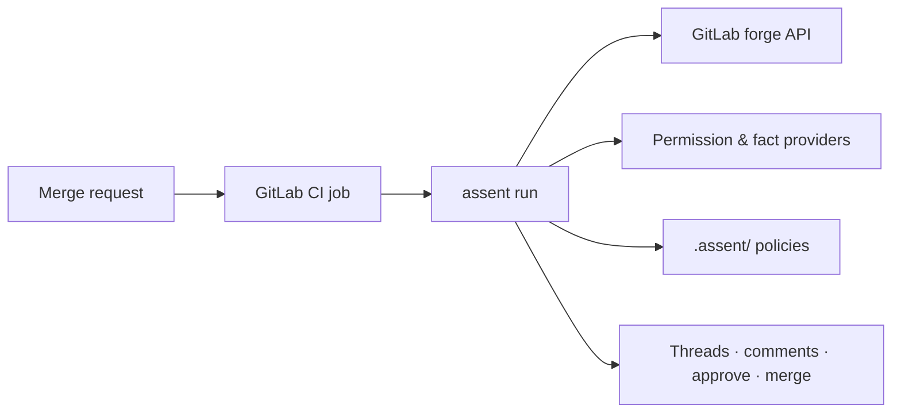

<div class="assent-hero">
  
  
</div>

# Deterministic approval for repository changes

> **Canonical repo:** GitHub ([PlatformRelay/assent](https://github.com/PlatformRelay/assent)).
> **Status: alpha** — the GitLab CI path is **Core** (E1–E9 engine, forge, provider, renderer).
> Pre-1.0: policy schema and CLI flags may change between releases; see
> [API stability](api-stability.md).

**assent** is a deterministic, policy-driven **auto-merge gate** for self-service
configuration repositories. Drop it into a repo's CI pipeline and it turns merge requests
into decisions: **approve, comment, request changes, or block** — based on rules *you*
write in **Kyverno-style declarative YAML** with CEL predicates.

## Why

Most changes to config repos (topic definitions, service catalogs, tfvars, tenant onboarding
files) are routine: a team edits *their own* entries within safe bounds. Yet a human still has
to review every MR, reconstructing the same context each time — what changed, who owns it, is
it destructive, which policy applies. assent encodes that reasoning as policy so the routine
90% merges itself and reviewers spend their attention on the risky 10%.

- **Fail-safe decisions** — every run emits an auditable `DecisionRecord`; ambiguous policy
  fails closed ([ADR-0015](adr/0015-trust-boundaries-merge-integrity.md)).
- **Semantic diffs** — JSON, YAML, and HCL/tfvars parse into field-level adds/modifies/deletes,
  not line noise; `.tf` files are governed but opaque (whole-file REVIEW, never a partial
  parse) ([ADR-0003](adr/0003-canonical-change-model.md)).
- **Testable policies** — fixture changes in, expected decision out; policies without tests
  are a lint error ([ADR-0014](adr/0014-adopter-test-format.md)).

## How it works



Key property: assent is **stateless per invocation** — every run recomputes the decision
from (diff, repo snapshot, facts, policy version). No database, no long-lived service in v1.
See [system context](architecture/c4-context.md) for the full C4 diagram.

## Quick start

Install from source ([install guide](usage/install.md)):

```bash
go install github.com/PlatformRelay/assent/cmd/assent@latest
assent version
```

`go install` compiles without link-time stamping, so the binary it produces reports
`assent 0.0.0-dev` — even when you pin a tag (`@v0.4.0`). For a **version-stamped**
binary take the Homebrew tap or a release archive: goreleaser injects the version
(`-X main.version`) and the archives are checksum- and signature-verifiable. Both
routes are in [docs/usage/install.md](usage/install.md).

Lint and test policies locally. Both commands take the **repository root** — `assent`
appends `.assent` itself, so passing `.assent/` makes it look for `.assent/.assent`:

```bash
assent lint .
assent test .
```

No repo of your own yet? A clone of this one ships runnable sample policy trees; run the
two commands above from `examples/packs/service-catalog` (that is the fixture
`hack/docs/readme_smoke_test.sh` executes this block against).

Runs on a real merge request select their forge explicitly (E10-S13 — no default forge):

```bash
GITLAB_TOKEN=<pat> assent run --forge gitlab --project 42 --mr 7 --subject file:topics/orders.yaml --bot-author assent-bot
GITHUB_TOKEN=<token> assent run --forge github --project owner/repo --mr 7 --bot-author assent-bot
```

On GitHub v1 runs **comment-only** — they decide and comment but never arm auto-merge until
a decidable `protected-pipeline-source` predicate exists ([OQ-33](planning/open-questions.md);
[OQ-34](planning/open-questions.md) holds `require-review` evidence to the same bar).
Unprobed capabilities never arm ([ADR-0021](adr/0021-multi-adapter-forge-seam.md) §3).

## Start here

- [Vision & intended use case](vision.md)
- [Adoption walkthrough](usage/walkthrough.md)
- [ADRs](adr/README.md)
- [Architecture: C4 context](architecture/c4-context.md) · [C4 containers](architecture/c4-container.md)
- [Decision log](decisions/decisions.md)

## Contributing

- [Meta-plan](planning/meta-plan.md)
- [Open questions](planning/open-questions.md)
