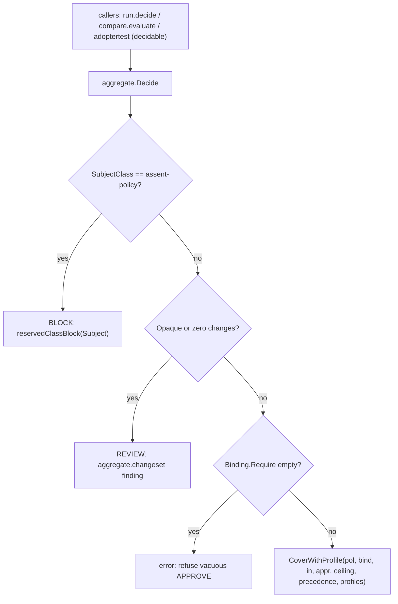

# P5-XREV — design

## S01 — the guarded engine entry (D2)

Today the three dominating guards live in `cmd/assent/run.go`'s `decide`, are partially
re-created in `adoptertest`, and are absent from `compare`; the only engine-level copy sits
on the compiler-proven dead `Aggregate`. The fix moves the guards to one entry:



`DecideRequest` carries the guard signals explicitly (the frozen `EvaluationInput` wire shape
carries neither subject class nor opacity):

```go
type DecideRequest struct {
    Subject      string
    SubjectClass string
    Opaque       bool
    Policy       *policy.MergePolicy
    Binding      *policy.Binding
    Input        *EvaluationInput
    Approval     *ApprovalContext
    Ceiling      policy.Phase
    Precedence   []policy.ProfileRef
    Profiles     []*policy.Profile
}
```

- **One entry, one call path.** `Decide` always finishes at `CoverWithProfile`. Empty
  precedence/profiles resolves to no covering profile → no write authority, the safe default
  (`internal/core/aggregate/profile.go:114-124`), so the entry is byte-identical to
  `CoverWithPhaseCeiling` for `run` and to `CoverWithApproval` for `adoptertest` (ceiling
  normalizes to enforce).
- **`compare` reaches two of the three guards, by construction.** Its input comes from
  `LoadBundle` → `LoadEvaluationInput`, which has no class and no opacity field, so `compare`
  passes `SubjectClass:""`, `Opaque:false` and enforces the **empty-changeset** and
  **empty-`require`** guards. That matches the report's own D2 admission that
  `EvaluationInput` structurally cannot carry the other two; it is not a gap this change
  invents.
- **`adoptertest`'s undecidable path is the one exception.** Its opaque/empty cases return a
  bare REVIEW with no findings — a shape the shipped fixtures document and `assent test
  --update` pins (`examples/packs/infra-vars/.assent/tests/vars/tf-opaque/expect.yaml`). The
  adopter-test fixture format is frozen (ADR-0014), so changing that shape is a contract
  change, not a bug fix. `Evaluate` therefore keeps its bare-REVIEW early return for the
  undecidable case and routes only the decidable path through `Decide` (where the
  empty-`require` guard closes the same latent vacuity `compare` had).

**Deleted dead chain:** `Aggregate`, `failSafe`, `newCELEnv`, `bindActivation`, `evalRule`,
`Rule`, `Binding`, `OnFailure`. **Kept:** `Cover` (≈80 test callers, no production caller) —
removing it is a separate mechanical lane; `ruleUndecidable` (now used by `Decide`);
`sortFindings`/`worse`/`effectDecision`/`severity` (live in `coverage.go`/`risk.go`).

Retargets: `internal/core/classify/assent_policy_golden_test.go` builds a `policy.MergePolicy`
+ `policy.Binding` + `EvaluationInput` and calls `Decide` (control with class `""` → APPROVE;
with `assent-policy` → BLOCK); `internal/core/decision/tokenless_test.go` scans
`aggregate.DecideRequest` instead of `aggregate.Binding`.

## S02 — shared matcher (D3)

Export `aggregate.MatchesAny(m policy.Match, changes []EvalChange) (bool, error)` (a thin
wrapper over the existing `matchChanges`) and delete `adoptertest.ruleMatchesAny` +
`matchesAnyGlob` + `containsStr`. The parity test drives the four domains (files, values,
valueChanges, fileEvents) through both the export and an inlined reference predicate over a
shared corpus, plus a deliberate-mismatch control so the assertion is non-vacuous after the
clone is gone.

## S04 — hygiene

- D16: parameterise the walk root in `TestExampleContractsFixturesValidate` so absent/empty/
  no-doc can be driven from a temp tree and must `Fatal`.
- D17: `//go:build ignore` on the spike; `hack/spikes/buildtag_test.go` parses the constraint.
- D18: a local `fs.FS` adapter over one file replaces `testing/fstest.MapFS`; no behaviour
  change to `LoadResourceOwnerMap`.

## Sequencing

S02 and S04 are file-disjoint and independent. S03 owns `hack/docs/truthlag_pins_test.sh`,
`README.md`, `docs/`, `internal/README.md`, `go.mod`, the rego comment, and `cmd/assent/run.go`'s
flag help string. S01 owns `internal/core/aggregate/**`, `internal/adoptertest/**`,
`internal/compare/**`, `cmd/assent/run.go`'s `decide`. Recommended order:
**S02 → S04 → S03 → S01** (small to large; S01 last).
